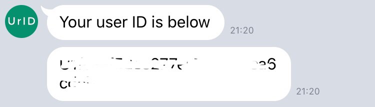

# LINE bot - Your ID 
By just initiate a chat with this bot, it simply lets you know your own user ID which you can use for any purpose. It's mostly useful for early-stage development work or targeted group testing.

## How to use
You can add friend using `@490mokul` or the following QR Code.  
  

  
  
